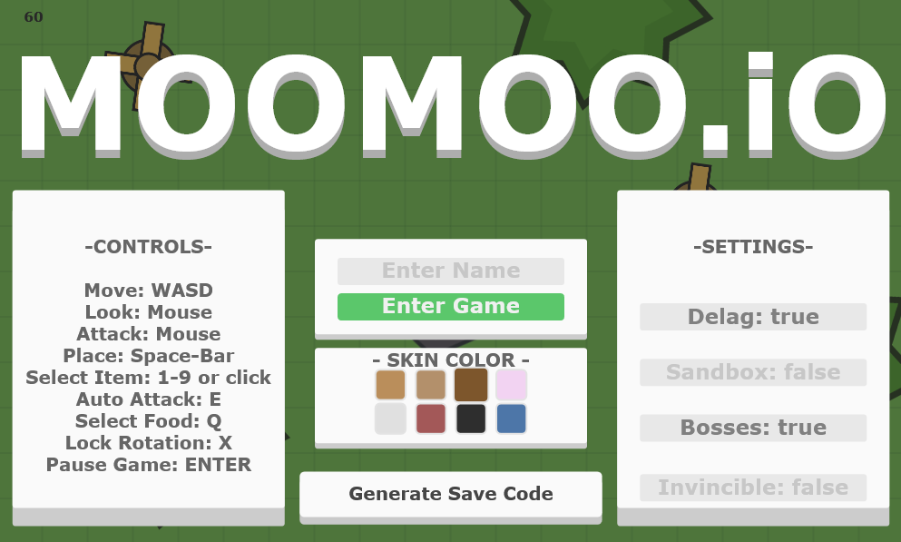
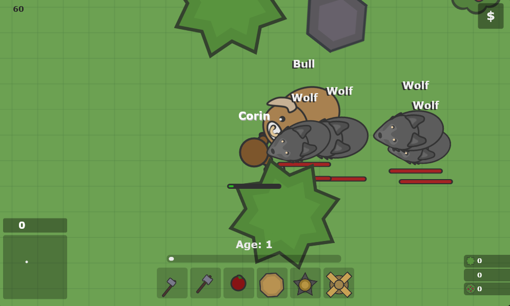

# MooMoo.io

A browser recreation of the survival-and-building game *moomoo.io*, originally
built in Khan Academy's ProcessingJS between February and March 2021 and
released on 22 March 2021. All of the artwork — roughly 1,500 lines of it — is
drawn in code. There are no image files anywhere in this project.

**[Play it here](https://robertbrowndev-cloud.github.io/moomoo.io-clone/)** — replace this link with your GitHub Pages URL.


|  |  |
| :---: | :---: |
|  |  |


## The game

You start in a field with a stick and nothing else. Hit trees for wood, rocks
for stone, bushes for food, and gold ore for money. Spend the resources on
walls, spikes, traps, windmills and platforms, and use them to build somewhere
defensible before the wildlife finds you.

The map runs 9,000 units across three biomes. snow at the top, grassland
through the middle, desert at the bottom. with a river cutting across. Snow
slows you down unless you are wearing the right hat.

Gathering earns experience, experience raises your age, and each age lets you
choose a new item: better axes, a katana, a polearm, a dagger, poison spikes,
teleporters, healing pads. Choices are permanent for that run, so the build you
commit to early shapes the rest of it.

Pigs, cows and sheep flee. Wolves and bulls do not — run at either one head-on
and you will lose. Three dragons guard the centre of the map behind a ring of
boulders, and gold buys hats and capes that change how you play: a snow cap for
the north, a bloodthirster that trades health for damage, wings that heal you
as you fight.

Finishing means killing three dragons and buying everything in the shop.

## Controls

| | |
|---|---|
| Move | `W` `A` `S` `D` |
| Aim | Mouse |
| Attack | Click, or `E` to auto-attack |
| Place building | `Space` |
| Select item | `1`–`9`, or click the bar |
| Eat | `Q` |
| Lock rotation | `X` |
| Pause | `Enter` |

## Tips

Build spikes around yourself early — they hurt anything that touches you and
buy time you will not otherwise get.

If a bull charges, circle it rather than running in a straight line. Bulls
turn slowly and lose track of you.

The snow biome is where the dangerous animals concentrate. Without the snow
cap you move at reduced speed there, which is usually fatal.

Dying is normal while you learn the map. If you would rather explore than
fight, invincibility is in the settings on the title screen.

## Settings

Available from the title screen before you start:

- **Delag** — fewer animals and simpler effects, for slower machines
- **Sandbox** — building costs nothing
- **Bosses** — whether the three dragons spawn
- **Invincible** — no damage taken

## Save codes

The shop remembers what you own through a save code. Click **Generate Save
Code** on the title screen and the code is printed to the browser console
(`F12` → Console). Paste it over the `SaveCode` block at the top of `game.js`
to keep your hats and capes.

## Credits

Made by **Corin Fist**. Based on *moomoo.io* by Sidney de Vries.

Thanks to woolstone, whose encouragement got the project finished, and who is
the reason every sheep in the game is named Woolstone. Thanks also to Duskpin
for finding bugs during development.

© Corin Fist Productions

## Running it locally

Clone the repository and open `index.html`. There is no build step and no
dependencies.

Some browsers restrict what a page can do when opened directly from disk. If
anything misbehaves, serve the folder instead:

```
python3 -m http.server 8000
```

then visit `http://localhost:8000`.
